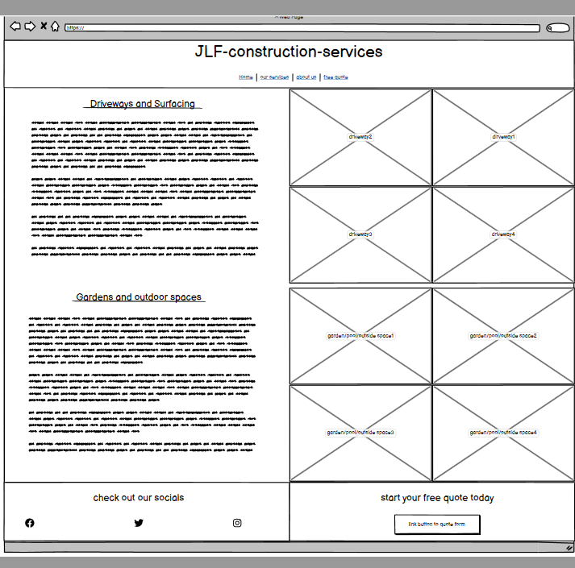

# JLF-construction-services
(Developer: Jason Foster)

[Live webpage]

## Table of Content

1. [Project Goals](#project-goals)
    1. [User Goals](#user-goals)
    2. [Site Owner Goals](#site-owner-goals)
2. [User Experience](#user-experience)
    1. [Target Audience](#target-audience)
    2. [User Requirements and Expectations](#user-requirements-and-expectations)
    3. [User Stories](#user-stories)
3. [Design](#design)
    1. [Design Choices](#design-choices)
    2. [Colour](#colours)
    3. [Fonts](#fonts)
    4. [Structure](#structure)
    5. [Wireframes](#wireframes)
4. [Technologies Used](#technologies-used)
    1. [Languages](#languages)
    2. [Frameworks & Tools](#frameworks-&-tools)
5. [Features](#features)
6. [Testing](#validation)
    1. [HTML Validation](#HTML-validation)
    2. [CSS Validation](#CSS-validation)
    3. [Accessibility](#accessibility)
    4. [Performance](#performance)
    5. [Device testing](#performing-tests-on-various-devices)
    6. [Browser compatibility](#browser-compatability)
    7. [Testing user stories](#testing-user-stories)
8. [Bugs](#Bugs)
9. [Deployment](#deployment)
10. [Credits](#credits)
11. [Acknowledgements](#acknowledgements)

## Project Goals 

### User Goals
- Finding a local, reliable construction company.
- Finding information about the company and its ideals.
- To see the quality of the work provided.
- To be able to get a quote for work wanted.

### Site Owner Goals
- Increase the number of customers it has.
- Promote/advertise the company.
- Provide a way for customers to contact the company.
- Provide information about the company to customers.

## User Experience

### Target Audience
- People wanting a new driveway or garden area.
- People needing any type of building maintenance or repair work carried out.

### User Requirements and Expectations

- A simple and easy to use navigation system.
- Quickly and easily find relevant information.
- Links and functions should work as expected.
- A well presented and visually appealing design regardless of screen size.
- An easy way to contact the company.
- Simple content that doesnt overwhelm the user.
- Accessibility and performance.

### User Stories

#### First-time User 
1. As a first time user, I want to find out more about the company.
2. As a first time user, I want to know what services are provided.
3. As a first time user, I want to find out where the company is based.
4. As a first time user, I want to see the quality of the work provided.

#### Returning User
5. As a returning user, I want to contact the company.
6. As a returning user, I want to arrange a quote.

#### Site Owner 
7. As the site owner, I want users to be able to contact us easily.
8. As the site owner, I want to attract the users attention.
9. As the site owner, I want to advertise and promote the companies qualities.

## Design

### Design Choices

The webpage was designed to be eye catching, informative and easy to navigate around.

### Colour
For the colour scheme bright colours were chosen to catch the users eye and draw attention
to information and links on the page. Green and blue was chosen as they are visually pleasing positive on screen colours and the light grey in the header and footer is a neutral colour that goes well with the colours on the page. 
 

### Fonts

Playfair+Display was used for the logo and headings as it looks good in a larger font size and is easy to read. 
 
Merriweather was used for the body text as it compliments the headings nicely and is highly readable on screen, both have back up font of sans-serif as its also easily readable on screen.

### Structure
The page is structured in a recognizable, user friendly and easy to learn way. on arriving to the site the user sees a logo with a familiar type of navigation bar underneath it, with the links spaced out under the logo that highlight on mouse over.
The website consists of four separate pages: 
- A homepage with a sections of What we do, small paragraph explaining what we do with images and links to our services page.
- An our services page consisting of images and information detailing the services provided.
- An about us page with a contact us section.
- A free quote (form) page which opens in a new tab.

### Wireframes

Home

Our services

About us

Free Quote

## Technologies Used

### Languages
- HTML
- CSS

### Frameworks & Tools
- Git
- GitHub
- Gitpod
- Balsamiq
- Google Fonts
- Adobe Color
- Font Awsome
- Favicon.io

## Features
The page consists of four pages and nine features

### Logo and Navigation Bar
- Featured on all five pages
- The navbar is fully responsive and changes to a toggler (hamburger menu) on smaller screens and includes
links to the Homepage, About page, Menu page, Gallery and Contact us page
- It allows users to easily navigate the page
- The link for the page the user is currently on is highlighted 

### Home-page-image
- Introduces the user to the restaurant with a small three picture slide show
- Options for the user to navigate the slide show via back and forward arrows or indicators at the bottom

### What we do
- Allowes the user to see upcoming events or any news about the restaurant
- User stories covered: 13

### Footer
- Allowes users to see what meal-deal is available for the upcoming Sunday
- User stories covered: 5

### Our-services
- Featured on all five pages
- Consists of three seperate sections: contact information, opening times, and social media links
- User stories covered: 1, 6, 7, 10, 15

### About Us
- Gives a description of the restaurant and its facilities with a image of the front of the building on the right side
- User stories covered: 3, 14

### Contact us
- Features a few reviews left by the restaurants customers on social media
- User stories covered: 3

### Embedded google map
- Features a short bio of the chef with an image of the chef on the left side
- User stories covered: 11

### Free quote form

