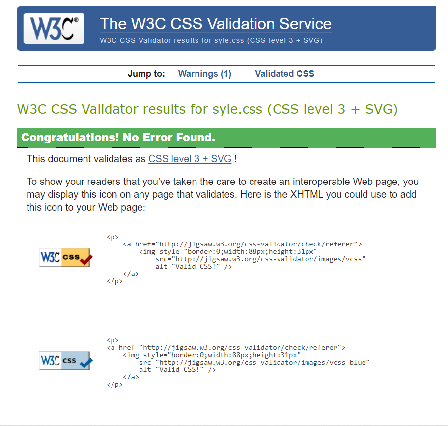
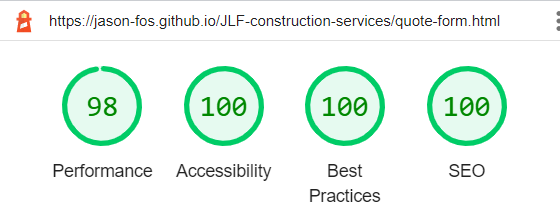

# JLF-construction-services
(Developer: Jason Foster)

[Live webpage]

## Table of Content

1. [Project Goals](#project-goals)
    1. [User Goals](#user-goals)
    2. [Site Owner Goals](#site-owner-goals)
2. [User Experience](#user-experience)
    1. [Target Audience](#target-audience)
    2. [User Requirements and Expectations](#user-requirements-and-expectations)
    3. [User Stories](#user-stories)
3. [Design](#design)
    1. [Design Choices](#design-choices)
    2. [Colour](#colours)
    3. [Fonts](#fonts)
    4. [Structure](#structure)
    5. [Wireframes](#wireframes)
4. [Technologies Used](#technologies-used)
    1. [Languages](#languages)
    2. [Frameworks & Tools](#frameworks-&-tools)
5. [Features](#features)
6. [Testing](#validation)
    1. [HTML Validation](#HTML-validation)
    2. [CSS Validation](#CSS-validation)
    3. [Accessibility](#accessibility)
    4. [Performance](#performance)
    5. [Device testing](#performing-tests-on-various-devices)
    6. [Browser compatibility](#browser-compatability)
    7. [Testing user stories](#testing-user-stories)
8. [Bugs](#Bugs)
9. [Deployment](#deployment)
10. [Credits](#credits)
11. [Acknowledgements](#acknowledgements)

## Project Goals 

### User Goals
- Finding a local, reliable construction company.
- Finding information about the company and its ideals.
- To see the quality of the work provided.
- To be able to get a quote for work wanted.

### Site Owner Goals
- Increase the number of customers it has.
- Promote/advertise the company.
- Provide a way for customers to contact the company.
- Provide information about the company to customers.

## User Experience

### Target Audience
- People wanting a new driveway or garden area.
- People needing any type of building maintenance or repair work carried out.

### User Requirements and Expectations

- A simple and easy to use navigation system.
- Quickly and easily find relevant information.
- Links and functions should work as expected.
- A well presented and visually appealing design regardless of screen size.
- An easy way to contact the company.
- Simple content that doesnt overwhelm the user.
- Accessibility and performance.

### User Stories

#### First-time User 
1. As a first time user, I want to find out more about the company.
2. As a first time user, I want to know what services are provided.
3. As a first time user, I want to find out where the company is based.
4. As a first time user, I want to see the quality of the work provided.

#### Returning User
5. As a returning user, I want to contact the company.
6. As a returning user, I want to arrange a quote.

#### Site Owner 
7. As the site owner, I want users to be able to contact us easily.
8. As the site owner, I want to attract the users attention.
9. As the site owner, I want to advertise and promote the companies qualities.

## Design

### Design Choices

The webpage was designed to be eye catching, informative and easy to navigate around.

### Colour
For the colour scheme bright colours were chosen to catch the users eye and draw attention
to information and links on the page. Green and blue was chosen as they are visually pleasing positive on screen colours and the light grey in the header and footer is a neutral colour that goes well with the colours on the page. 
 

### Fonts

Playfair+Display was used for the logo and headings as it looks good in a larger font size and is easy to read. 
 
Merriweather was used for the body text as it compliments the headings nicely and is highly readable on screen, both have back up font of sans-serif as its also easily readable on screen.

### Structure
The page is structured in a recognizable, user friendly and easy to learn way. on arriving to the site the user sees a logo with a familiar type of navigation bar underneath it, with the links spaced out under the logo that highlight on mouse over.
The website consists of four separate pages: 
- A homepage with a sections of What we do, small paragraph explaining what we do with images and links to our services page.
- An our services page consisting of images and information detailing the services provided.
- An about us page with a contact us section.
- A free quote (form) page which opens in a new tab.

### Wireframes

Home

Our services

About us

Free Quote

## Technologies Used

### Languages
- HTML
- CSS

### Frameworks & Tools
- Git
- GitHub
- Gitpod
- Balsamiq
- Google Fonts
- Adobe Color
- Font Awsome
- Favicon.io

## Features
The page consists of four pages and nine features

### Logo and Navigation Bar
- Featured on all four pages
- The navbar is responsive and changes to suit the users screen.
- It includes links to the Homepage, Our services page, About us page and Free quote form page.
- It allows users to easily navigate around the page.
- The links highlight and underline green on mouseover so user knows its interactive. 

### Home Page Image
- Introduces the user to the page with an eye cathcing image of a high end property and driveway.
- Allows the user to see very briefly the style and type of work done by the company.
- User stories covered: 8, 9

### What We Do
- Allows users to read a brief description of some of the services provided as well as a brief intro into the company.
- There is an image each of some surfacing materials and a rear garden with a swimming pool so users can see a small image of 
  services provided.
- There are 3 links, 1 for driveways and surfacing services, 1 for garden and outdoor spaces services and another for the about
  us section.  
- User stories covered: 1, 2, 3, 8, 9

### Footer
- Contains links to social media accounts allowing users to find more info and images about the company.
- Link to the free quote form in the footer allowing the user to start a quote.
- User stories covered: 1, 6, 9

### Our Services
- Contains text detailing the services and works provided clearly to the user.
- Contains images to show the user the quality of works provided
- User stories covered: 2, 4, 8, 9

### About Us
- Gives a description of the company, its qualities and ideals so the user can better understand the company.
- User stories covered: 1, 3, 9

### Contact Us
- Features clear information for users to contact the company.
- User stories covered: 5, 7

### Embedded Google Map
- Embedded google map providing location of the company to the user.
- User stories covered: 3, 7

### Free Quote Form
- Allows the user to arrange a free quote for the service they are wanting.
- User stories covered: 6

## Validation

### HTML Validation
The W3C Markup Validation Service was used to validate the HTML of the website, entire site passed with 0 errors or w

Entire site

### CSS Validation
The W3C Jigsaw CSS Validation Service was used to validate the CSS of the website.

Entire site

### Accessibility
The WAVE WebAIM web accessibility evaluation tool was used to ensure the website met high accessibility standards. All pages had 4 contrast errors due to the font of the navbar links being too small or not bold enough. Easily fixed by making link headings bold.

errors

Home

Our services

About us

Free quote form

### Performance 
Google Lighthouse in Google Chrome Developer Tools was used to test the performance of the website. 

Home

Our services

About us

Free quote form

